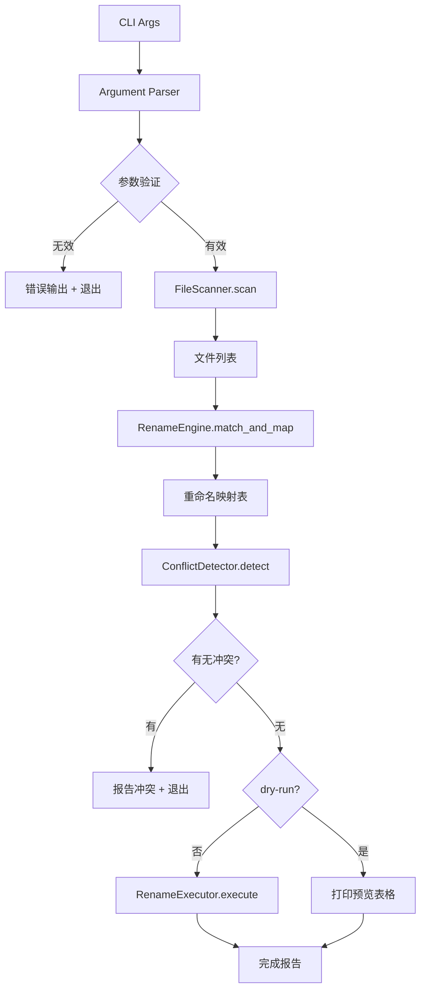

# 概要设计说明书

## 1. 引言

### 1.1 编写目的

本文档描述"批量文件重命名命令行工具"的整体架构设计，包括系统架构、模块划分、数据设计和接口设计，为详细设计提供框架性指导。

### 1.2 设计依据

本设计基于以下文档：
- 《可行性研究报告》（`docs/feasibility-study/《可行性研究报告》.md`）
- 《软件需求规格说明书》（`docs/requirements/《软件需求规格说明书》.md`）

### 1.3 设计目标与约束

- **简单性**：单文件脚本或最小模块结构，易于分发和维护
- **零依赖**：仅使用 Python 标准库
- **跨平台**：Linux、macOS、Windows 均可运行
- **安全优先**：dry-run 默认推荐、冲突检测、无意外覆盖

## 2. 系统架构设计

### 2.1 整体架构风格

采用 **分层架构 + 管道模式**（Pipeline Pattern）。数据从 CLI 参数输入，依次经过验证层、扫描层、匹配层、冲突检测层和重命名执行层，形成清晰的数据处理管道。

```
┌─────────────────────────────────────────────────────┐
│                  CLI 接口层 (cli.py)                  │
│              argparse 参数解析与验证                   │
├─────────────────────────────────────────────────────┤
│                 核心逻辑层 (core.py)                   │
│  ┌──────────┐  ┌──────────┐  ┌──────────────────┐  │
│  │  扫描器  │→│ 重命名引擎│→│   安全与报告模块   │  │
│  │ Scanner  │  │  Engine  │  │  Safety & Report  │  │
│  └──────────┘  └──────────┘  └──────────────────┘  │
├─────────────────────────────────────────────────────┤
│                文件系统（os / pathlib / shutil）      │
└─────────────────────────────────────────────────────┘
```

### 2.2 架构图



### 2.3 技术选型及理由

| 技术项 | 选择 | 理由 |
|--------|------|------|
| 编程语言 | Python 3.8+ | 跨平台、标准库强大、正则支持好 |
| CLI 框架 | `argparse` | 标准库，无需安装，功能完备 |
| 正则引擎 | `re` | 标准库，PCRE 风格，支持反向引用 |
| 路径处理 | `pathlib` | 面向对象路径操作，跨平台抽象 |
| 文件操作 | `shutil.move` / `os.rename` | 标准库，简单可靠 |
| 测试框架 | `unittest` | 标准库，无需额外依赖 |
| 打包分发 | 单文件脚本 | 最简单的分发方式 |

## 3. 模块划分

### 3.1 模块清单与职责

| 模块 | 文件名 | 职责 |
|------|--------|------|
| CLI 入口 | `rename_tool.py` | 程序入口，解析命令行参数，协调各模块 |
| 配置模型 | `config.py` | 数据类定义，保存所有用户输入的配置参数 |
| 文件扫描器 | `scanner.py` | 扫描目录获取文件列表，支持递归和过滤 |
| 重命名引擎 | `engine.py` | 正则匹配与替换，生成重命名映射表 |
| 冲突检测器 | `conflict.py` | 检测目标文件名冲突 |
| 重命名执行器 | `executor.py` | 执行实际的重命名操作 |
| 报告输出 | `reporter.py` | 格式化输出 dry-run 表格和执行结果 |

### 3.2 模块间依赖关系

```
rename_tool.py  ──→  config.py
rename_tool.py  ──→  scanner.py
rename_tool.py  ──→  engine.py
rename_tool.py  ──→  conflict.py
rename_tool.py  ──→  executor.py
rename_tool.py  ──→  reporter.py

engine.py  ──→  config.py
scanner.py ──→  config.py
conflict.py ──→ (无依赖)
executor.py ──→ (标准库)
reporter.py ──→ (标准库)
```

### 3.3 模块接口定义

#### 3.3.1 配置模型 (config.py)

```python
@dataclass
class RenameConfig:
    directory: Path            # 目标目录
    pattern: str               # 正则模式
    replacement: str           # 替换字符串
    recursive: bool = False    # 是否递归
    dry_run: bool = False      # 是否预览模式
    ignore_case: bool = False  # 是否忽略大小写
    filter_glob: str | None    # 文件名筛选 glob
    force: bool = False        # 是否强制覆盖
    verbose: bool = False      # 详细输出
```

#### 3.3.2 文件扫描器 (scanner.py)

```
输入: RenameConfig
输出: list[Path]  已过滤的文件路径列表
```

#### 3.3.3 重命名引擎 (engine.py)

```
输入: list[Path], RenameConfig
输出: list[RenameMapping]  原路径到新文件名的映射
```

#### 3.3.4 冲突检测器 (conflict.py)

```
输入: list[RenameMapping]
输出: list[ConflictInfo]  冲突信息列表（无冲突则为空）
```

#### 3.3.5 重命名执行器 (executor.py)

```
输入: list[RenameMapping], force: bool
输出: RenameResult  成功/失败计数和详情
```

## 4. 数据设计

### 4.1 数据库选型及理由

本工具为无状态命令行工具，不涉及数据库。所有数据在内存中处理。

### 4.2 ER 图 / 实体关系描述

核心数据实体关系：

```
RenameConfig ──1:N──> Path (文件路径)
Path ──1:1──> RenameMapping (每个匹配文件一个映射)
RenameMapping ──1:1──> RenameResult (执行结果)
```

### 4.3 核心数据结构设计

| 结构 | 字段 | 类型 | 说明 |
|------|------|------|------|
| RenameMapping | original_path | Path | 原文件完整路径 |
| | new_name | str | 新文件名（不含路径） |
| | new_path | Path | 新文件完整路径（计算字段） |
| | matched | bool | 正则是否匹配 |
| | status | RenameStatus | pending / success / skipped / failed / conflict |
| ConflictInfo | path_a | Path | 冲突文件 A 的原路径 |
| | path_b | Path | 冲突文件 B 的原路径 |
| | target_name | str | 冲突的目标文件名 |
| RenameResult | success_count | int | 成功重命名数 |
| | skip_count | int | 跳过数（未匹配） |
| | fail_count | int | 失败数 |
| | details | list[RenameMapping] | 详细结果列表 |

## 5. 接口设计

### 5.1 外部 API 设计

本工具为命令行程序，无 REST/GraphQL API。

### 5.2 命令行接口规范

```
用法: rename-tool -d <目录> -p <正则模式> -r <替换字符串> [选项]

必选参数:
  -d, --directory DIR    目标目录路径
  -p, --pattern PATTERN  正则表达式匹配模式
  -r, --replacement REPL 替换字符串（支持 \\1, \\2 等反向引用）

可选参数:
  -R, --recursive        递归处理子目录
  --dry-run              预览模式，仅显示操作而不执行
  -f, --filter GLOB      文件名过滤（glob 模式，如 *.txt）
  -i, --ignore-case      正则匹配忽略大小写
  --force                强制覆盖已存在的目标文件
  -v, --verbose          显示详细处理信息
  -h, --help             显示帮助信息

退出码:
  0  成功
  1  参数错误
  2  文件操作错误（冲突、权限等）
```

### 5.3 内部模块间通信方式

所有模块间通过 Python 函数调用直接传递数据，使用类型提示保证接口契约。无进程间通信或网络通信。

## 6. 部署架构

### 6.1 部署拓扑图

```
用户终端
  │
  ├── Python 3.8+ 运行时
  │     │
  │     └── rename_tool.py (单文件或 pip 安装)
  │
  └── 本地文件系统
        ├── 目标目录
        └── 子目录（可选递归）
```

### 6.2 运行环境要求

- Python 3.8 或更高版本
- 无需任何第三方 pip 包
- 文件系统支持 UTF-8 编码的文件名

## 7. 技术风险与应对

| 风险 | 可能性 | 影响 | 应对策略 |
|------|--------|------|----------|
| 正则 ReDoS 攻击 | 低 | 中 | 使用 `re.compile` 预编译，监控匹配耗时 |
| 文件名编码问题 | 中 | 低 | `pathlib` 自动处理编码，Python 3 原生 Unicode 支持 |
| Windows 路径分隔符混入 | 中 | 中 | 替换结果中检测并拒绝包含 `/` 或 `\` 的文件名 |
| 并发文件访问冲突 | 低 | 低 | 单进程执行，无并发问题 |
| 超大目录性能下降 | 低 | 低 | 使用生成器惰性遍历，避免一次性加载全部文件 |