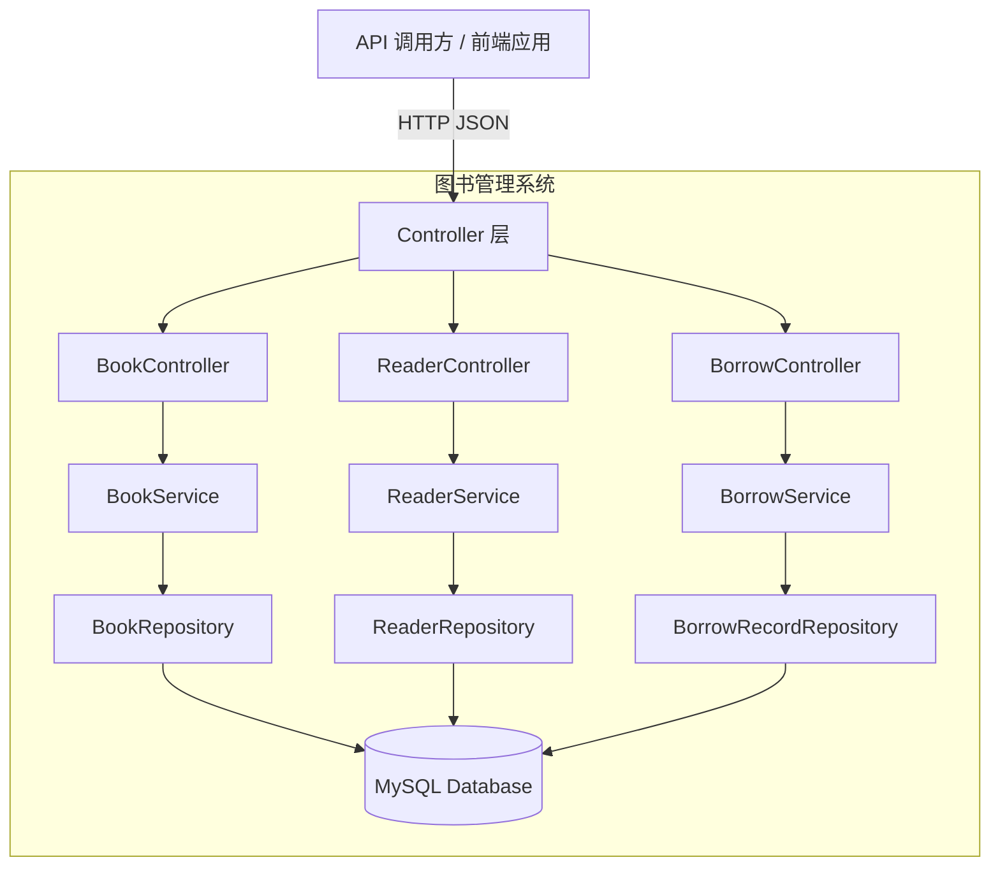

# 概要设计说明书

## 1. 引言

### 1.1 编写目的

本文档在需求分析的基础上，对图书管理系统进行概要设计。文档定义了系统的整体架构、技术选型、模块划分、数据库设计和技术风险应对策略，为后续的详细设计和编码实现提供指导。

### 1.2 设计依据

- 《软件需求规格说明书》 — 定义了系统的功能需求和非功能需求
- 《可行性研究报告》 — 确认了项目的技术方案可行性

### 1.3 设计目标与约束

- **设计目标**: 构建一个结构清晰、易于维护和扩展的图书管理后端服务
- **约束条件**:
  - 使用 Java Spring Boot + MySQL 技术栈
  - 遵循 RESTful API 设计规范
  - 实现 MVC 分层架构
  - 系统为单体应用，不拆分微服务

## 2. 系统架构设计

### 2.1 整体架构风格

系统采用经典的 **分层架构（Layered Architecture）**，基于 Spring Boot MVC 模式：

```
┌─────────────────────────────────────┐
│         表示层 (Controller)          │
│     REST API 端点, 请求验证          │
├─────────────────────────────────────┤
│         业务层 (Service)             │
│     核心业务逻辑, 事务管理            │
├─────────────────────────────────────┤
│         数据层 (Repository)          │
│     数据访问, ORM 映射               │
├─────────────────────────────────────┤
│         数据存储 (MySQL)             │
└─────────────────────────────────────┘
```

### 2.2 架构图



### 2.3 技术选型及理由

| 技术项 | 选型 | 理由 |
|--------|------|------|
| 后端框架 | Spring Boot 3.x | 企业级标准，自动配置，生态丰富 |
| 数据库 | MySQL 8.0 | 成熟稳定，支持事务，社区免费 |
| ORM | Spring Data JPA (Hibernate) | 简化数据库操作，自动建表，减少 SQL 编写 |
| API 规范 | RESTful JSON | 轻量级，跨平台，前后端分离友好 |
| 构建工具 | Maven | Java 生态标准构建工具 |
| 测试 | JUnit 5 + Mockito | 主流测试框架，Spring Boot 内置支持 |
| 参数校验 | Bean Validation (Hibernate Validator) | 声明式校验，与 Spring 无缝集成 |
| API 文档 | SpringDoc OpenAPI | 自动生成 Swagger UI 文档 |

## 3. 模块划分

### 3.1 模块清单与职责

系统分为三个核心业务模块和一个公共模块：

| 模块名称 | 职责 | 包含的类 |
|----------|------|----------|
| 图书管理模块 (book) | 图书的增删改查、库存管理 | BookController, BookService, Book, BookRepository |
| 读者管理模块 (reader) | 读者的注册、查询、修改、删除 | ReaderController, ReaderService, Reader, ReaderRepository |
| 借阅管理模块 (borrow) | 借书、还书、借阅记录查询、逾期查询 | BorrowController, BorrowService, BorrowRecord, BorrowRecordRepository |
| 公共模块 (common) | 统一响应格式、异常处理、常量定义 | ApiResponse, GlobalExceptionHandler, ErrorCode, Constants |

### 3.2 模块间依赖关系

```
借阅管理模块 ───依赖──→ 图书管理模块 (获取图书信息，更新可借数量)
借阅管理模块 ───依赖──→ 读者管理模块 (获取读者信息，校验读者状态)
```

### 3.3 模块接口定义

| 模块接口 | 调用方式 | 说明 |
|----------|----------|------|
| BookService | 方法调用 | 提供图书查询和库存变更方法 |
| ReaderService | 方法调用 | 提供读者查询方法 |
| BorrowService | 方法调用 | 提供借还书业务方法，内部调用 BookService 和 ReaderService |

## 4. 数据设计

### 4.1 数据库选型及理由

选择 **MySQL 8.0** 作为关系型数据库：
- 支持 ACID 事务，保证借还书操作的数据一致性
- 成熟稳定，运维成本低
- 社区版免费，满足业务需求

### 4.2 ER 图 / 实体关系描述

```
┌──────────┐          ┌────────────────┐          ┌──────────┐
│   Book   │          │ BorrowRecord   │          │  Reader  │
├──────────┤          ├────────────────┤          ├──────────┤
│ PK id    │──1:N────→│ PK id          │←──N:1───│ PK id    │
│ isbn     │          │ FK book_id     │          │ name     │
│ title    │          │ FK reader_id   │          │ phone    │
│ author   │          │ borrow_date    │          │ email    │
│ publisher│          │ due_date       │          │ type     │
│ year     │          │ return_date    │          │          │
│ category │          │ status         │          │          │
│ location │          │ created_at     │          │          │
│ total_copies│       │ updated_at     │          │          │
│ available_copies│   └────────────────┘          └──────────┘
└──────────┘
```

关系说明：
- Book 与 BorrowRecord 是 **1:N** 关系——一本书可以有多条借阅记录（历史记录）
- Reader 与 BorrowRecord 是 **1:N** 关系——一位读者可以有多条借阅记录

### 4.3 核心数据表设计

#### Book（图书表）

| 字段名 | 类型 | 约束 | 说明 |
|--------|------|------|------|
| id | BIGINT | PK, AUTO_INCREMENT | 主键 |
| isbn | VARCHAR(20) | NOT NULL, UNIQUE | 国际标准书号 |
| title | VARCHAR(200) | NOT NULL | 书名 |
| author | VARCHAR(100) | NOT NULL | 作者 |
| publisher | VARCHAR(100) | | 出版社 |
| publish_year | INT | | 出版年份 |
| category | VARCHAR(50) | | 分类 |
| location | VARCHAR(100) | | 书架位置 |
| total_copies | INT | NOT NULL, DEFAULT 1 | 馆藏总数 |
| available_copies | INT | NOT NULL, DEFAULT 1 | 当前可借数量 |
| created_at | DATETIME | DEFAULT CURRENT_TIMESTAMP | 创建时间 |
| updated_at | DATETIME | ON UPDATE CURRENT_TIMESTAMP | 更新时间 |

#### Reader（读者表）

| 字段名 | 类型 | 约束 | 说明 |
|--------|------|------|------|
| id | BIGINT | PK, AUTO_INCREMENT | 主键 |
| name | VARCHAR(50) | NOT NULL | 读者姓名 |
| phone | VARCHAR(20) | NOT NULL, UNIQUE | 联系电话 |
| email | VARCHAR(100) | | 邮箱 |
| reader_type | VARCHAR(20) | NOT NULL, DEFAULT '普通' | 读者类型（学生/教师/普通） |
| created_at | DATETIME | DEFAULT CURRENT_TIMESTAMP | 创建时间 |
| updated_at | DATETIME | ON UPDATE CURRENT_TIMESTAMP | 更新时间 |

#### BorrowRecord（借阅记录表）

| 字段名 | 类型 | 约束 | 说明 |
|--------|------|------|------|
| id | BIGINT | PK, AUTO_INCREMENT | 主键 |
| book_id | BIGINT | FK → Book.id, NOT NULL | 图书 ID |
| reader_id | BIGINT | FK → Reader.id, NOT NULL | 读者 ID |
| borrow_date | DATE | NOT NULL | 借阅日期 |
| due_date | DATE | NOT NULL | 应还日期 |
| return_date | DATE | | 实际归还日期 |
| status | VARCHAR(20) | NOT NULL, DEFAULT 'BORROWED' | 状态：BORROWED / RETURNED |
| created_at | DATETIME | DEFAULT CURRENT_TIMESTAMP | 创建时间 |
| updated_at | DATETIME | ON UPDATE CURRENT_TIMESTAMP | 更新时间 |

索引设计：
- `borrow_record` 表在 `status` 字段建索引，加速逾期查询
- `borrow_record` 表在 `book_id, reader_id, status` 建联合索引，加速借书重复性校验
- `book` 表在 `title` 字段建全文索引或前缀索引，加速书名搜索

## 5. 接口设计

### 5.1 外部 API 设计（REST 端点列表）

**统一前缀**: `/api/v1`

#### 图书管理 API

| 方法 | 路径 | 描述 | 需求编号 |
|------|------|------|----------|
| POST | `/api/v1/books` | 新增图书 | FR-BOOK-001 |
| GET | `/api/v1/books` | 查询图书列表（支持分页和条件筛选） | FR-BOOK-002 |
| GET | `/api/v1/books/{id}` | 查询单本图书详情 | FR-BOOK-003 |
| PUT | `/api/v1/books/{id}` | 修改图书信息 | FR-BOOK-004 |
| DELETE | `/api/v1/books/{id}` | 删除图书 | FR-BOOK-005 |

#### 读者管理 API

| 方法 | 路径 | 描述 | 需求编号 |
|------|------|------|----------|
| POST | `/api/v1/readers` | 新增读者 | FR-READER-001 |
| GET | `/api/v1/readers` | 查询读者列表（支持分页和名字搜索） | FR-READER-002 |
| GET | `/api/v1/readers/{id}` | 查询读者详情 | FR-READER-002 |
| PUT | `/api/v1/readers/{id}` | 修改读者信息 | FR-READER-003 |
| DELETE | `/api/v1/readers/{id}` | 删除读者 | FR-READER-004 |

#### 借阅管理 API

| 方法 | 路径 | 描述 | 需求编号 |
|------|------|------|----------|
| POST | `/api/v1/borrows` | 借书 | FR-BORROW-001 |
| PUT | `/api/v1/borrows/{id}/return` | 还书 | FR-BORROW-002 |
| GET | `/api/v1/borrows` | 查询借阅记录 | FR-BORROW-003 |
| GET | `/api/v1/borrows/overdue` | 查询逾期借阅 | FR-BORROW-004 |

### 5.2 内部模块间通信方式

模块间通过 Spring 的依赖注入（`@Autowired`）进行方法调用，通信方式为进程内同步调用。借阅模块调用图书模块和读者模块的 Service 方法来完成借还书操作。

### 5.3 第三方服务集成

本期无第三方服务集成需求。

## 6. 部署架构

### 6.1 部署拓扑图

```
┌────────────┐     ┌─────────────────┐     ┌────────────┐
│   客户端    │────→│  Spring Boot App │────→│  MySQL DB  │
│ (浏览器或   │     │  (localhost:8080)│     │  (3306端口)│
│  其他服务)  │     └─────────────────┘     └────────────┘
└────────────┘
```

### 6.2 运行环境要求

| 组件 | 版本要求 | 说明 |
|------|----------|------|
| JDK | 17+ | 编译和运行 |
| MySQL | 8.0+ | 数据持久化 |
| Maven | 3.8+ | 构建和依赖管理 |

## 7. 技术风险与应对

| 风险 | 影响 | 概率 | 应对措施 |
|------|------|------|----------|
| 并发借书导致库存超卖 | 一本书可能被借给多人 | 中 | 使用数据库乐观锁（@Version）或悲观锁保证 `available_copies` 更新原子性 |
| 大数量查询性能下降 | 响应时间变长 | 低 | 添加分页查询，为常用查询字段建索引 |
| 数据不一致 | 借阅记录与图书库存数对不上 | 低 | 借书和还书操作使用 `@Transactional` 保证事务一致性 |