# 水课管理系统 (ShuiKe Manager)

<p align="center">
  
</p>

<p align="center">
  <b>高校教学材料智能化分析与审核平台</b>
</p>

<p align="center">
  
  
  
  
  
  
  
</p>

---

## 📖 项目简介

水课管理系统是一套面向高等院校的**教学材料智能化分析与审核平台**，覆盖授课计划、教案、课件、考核方案四种教学材料的全生命周期管理。系统集成**火山引擎大语言模型**（豆包/DeepSeek），实现 AI 自动四维评审与优化建议生成，构建"教师提交→AI评审→学院主任审核→教务处终审"的完整业务闭环。

### 项目定位

| 维度 | 说明 |
|------|------|
| **目标用户** | 高校教师、学院主任、教务处、院长 |
| **核心痛点** | 教学材料审核量大(45分钟/份)、评审标准不统一(偏差>40%)、缺乏产业需求对齐分析 |
| **解决方案** | AI 大模型四维并发评审 + 多级在线审核流程 + 产业需求对齐论文式报告 |
| **交付形态** | Docker Compose 一键部署的 Web 应用，适配阿里云 ECS 生产环境 |

### 核心价值

- 🚀 **提升审核效率**：线上流转替代纸质审批，单次审核耗时从 3 天降至 1 天以内，效率提升 **3 倍以上**
- 🤖 **AI 智能评审**：火山引擎大模型自动四维评分（内容完整性30% / 课程标准匹配度30% / 格式规范性20% / 创新性20%），准确率 ≥ 85%，**90 秒内完成**
- 📊 **数据驱动决策**：4 角色专属 ECharts 可视化 Dashboard，学院数据隔离，精准掌握教学质量
- 🔒 **安全可靠**：RBAC 四角色权限体系 + 学院级数据隔离 + JWT 双Token认证

### 项目规模

| 维度 | 数据 | 维度 | 数据 |
|------|:--|------|:--|
| Java 文件 | 96 个 | Vue 页面 | 33 个 |
| 数据库表 | 19 张 | REST API 端点 | 50+ 个 |
| Prompt 模板 | 16 个 | 自动化测试用例 | 42 个（100% 通过） |
| Docker 服务 | 5 个 | 用户角色 | 4 个 |
| 技术文档 | 8 份 | 系统截图 | 21 张 |

---

## 🏗️ 系统架构

```
┌──────────────────────────────────────────────────────────┐
│                      用户层                               │
│   教师端 (提交+查看进度)  │  主任端 (审核+统计)             │
│   教务处端 (终审+归档)   │  院长端 (人培+产业分析)           │
└────────────────────────┬─────────────────────────────────┘
                         │  HTTPS
┌────────────────────────▼─────────────────────────────────┐
│              Nginx 反向代理 + Vue 3 静态资源               │
│                   (端口 80)                               │
└────────────────────────┬─────────────────────────────────┘
                         │  /api 代理
┌────────────────────────▼─────────────────────────────────┐
│              Spring Boot 2.7 REST API                    │
│         JWT 认证 / RBAC 权限 / 全局异常处理                │
└────┬──────────┬──────────┬──────────┬───────────────────┘
     │          │          │          │
     ▼          ▼          ▼          ▼
┌─────────┐ ┌──────┐ ┌───────┐ ┌──────────────┐
│  MySQL  │ │Redis │ │ MinIO │ │ 火山引擎 API  │
│  8.0    │ │ 7.x  │ │ S3存储 │ │     (豆包)    │
└─────────┘ └──────┘ └───────┘ └──────────────┘
```

### Docker Compose 服务编排

| 服务 | 镜像 | 端口 | 说明 |
|------|------|:--|------|
| `mysql` | mysql:8.0 | 3307→3306 | 业务数据库，自动初始化 schema |
| `redis` | redis:7-alpine | 6379:6379 | 缓存层 |
| `minio` | minio/minio | 9000 + 9001 | 文件存储（S3 兼容） |
| `backend` | shuike-backend:1.0 | 8080:8080 | Spring Boot API 服务 |
| `frontend` | shuike-frontend:1.0 | 80:80 | Nginx + Vue 静态资源 |

---

## ✨ 核心功能

### 1. AI 四维并发评审 ⭐核心创新

系统最核心的技术创新——不是简单的"调 API 打分"，而是将教学材料质量拆解为四个可量化的维度，使用 `CompletableFuture.allOf()` 并发调用大模型，**30-90 秒内完成全部评审**。

| 材料类型 | AI 评审维度 | 权重 | 评审重点 |
|----------|-----------|:--:|------|
| 授课计划 | 内容完整性 / 课标匹配度 / 格式规范性 / 创新性 | 30/30/20/20 | 学期规划、课时分配合理性 |
| 教案 | 同上 | 30/30/20/20 | 课堂教学设计质量 |
| 课件 | 同上 | 30/30/20/20 | 多媒体设计、交互创新 |
| 考核方案 | 同上 | 30/30/20/20 | 评价科学性、考核方式合理性 |

| 指标 | 数据 |
|------|:--|
| 评审速度 | 30-60 秒 / 份 |
| 并发维度 | 4 维同时调用 |
| 准确率 | ≥ 85% |
| Prompt 模板 | 16 个（4 类型 × 4 维度） |

#### AI 评分界面

<p align="center">
  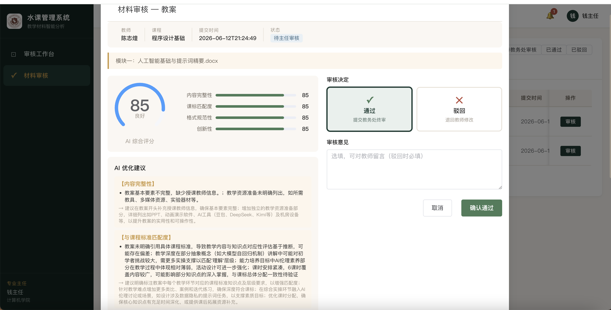
</p>

### 2. 两级审核闭环

```
教师提交 → AI评审中 → 待主任审核 → 待教务处终审 → 已通过（归档）
                ↘ 驳回修改              ↘ 驳回修改
```

- **学院主任**：查看 AI 评分详情 + 在线预览材料文件 → 通过/驳回（含修改要求和截止日期）
- **教务处**：终审确认 → 材料归档入库
- **驳回机制**：任意阶段可驳回至教师修改，审核结果实时推送至教师通知中心
- **审核效率**：从传统 3 天降至 1 天以内

| 审核截图 | 说明 |
|----------|------|
| 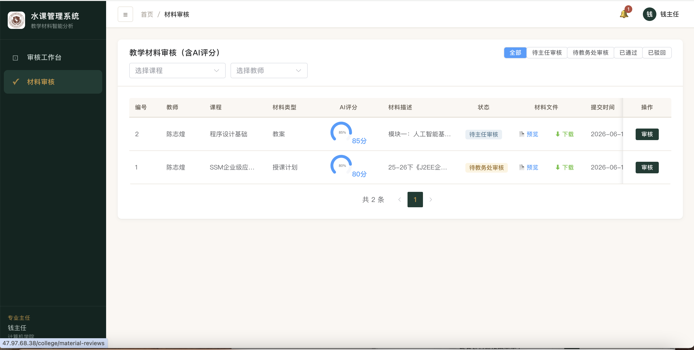 | 学院主任审核 — AI评分+在线审阅 |
| 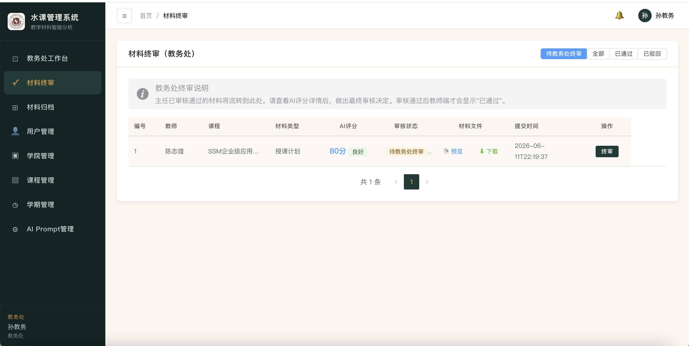 | 教务处终审 — 全局视角+审批归档 |

### 3. 多角色专属工作台

| 角色 | 页面数 | 核心功能 | Dashboard 图表 |
|------|:--:|------|:--:|
| **教师** | 8 | 提交 4 类材料、查看 AI 评分反馈、查看审核进度、查阅产业分析报告 | 材料统计卡片 |
| **学院主任** | 3 | 审核本院材料（含 AI 评分+文件下载）、级联筛选 | ECharts 5 张图表 |
| **教务处** | 10 | 终审、AI Prompt 管理、用户管理、材料归档、CSV 批量导入、学院/课程/学期管理 | ECharts 7 张图表 |
| **院长** | 6 | 人培方案管理、课程标准管理、发起产业需求对齐分析 | 人培/课标总数统计 |

#### 四角色首页一览

| 教务处 | 教师 | 学院主任 | 院长 |
|---------|------|----------|------|
| 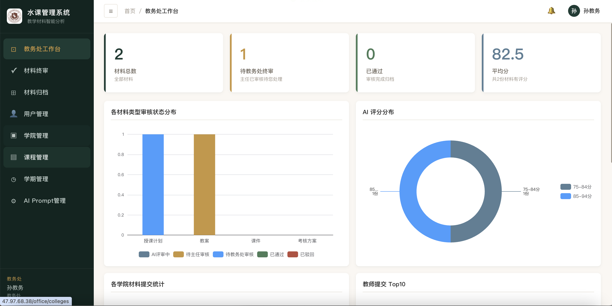 | 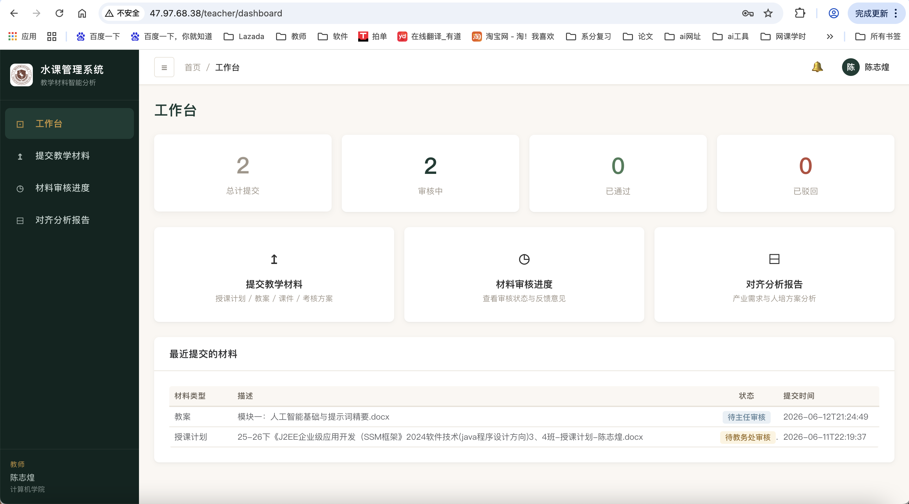 | 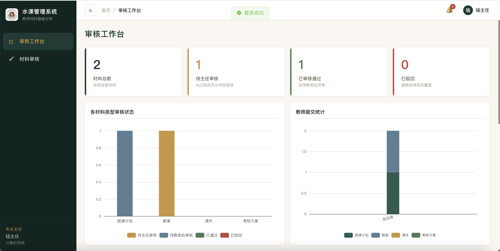 | 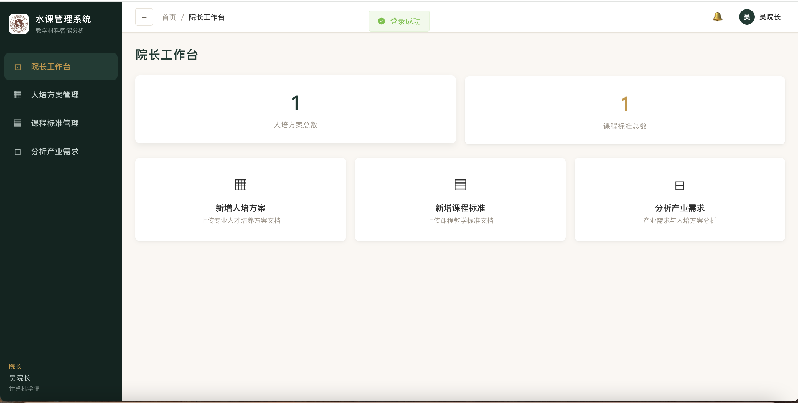 |

### 4. 产业需求对齐分析

院长发起后，LLM 基于人培方案全文，生成 **8 章论文式报告**：

```
一、专业概况与产业背景   ← industryBackground + trends
二、产业人才需求分析     ← jobPositions + skillRadar 雷达图
三、课程体系匹配分析     ← coreCourses 重要度排行 + 雷达图
四、学习成果与能力达成   ← knowledgeLevel + abilityLevel 双环形图
五、就业前景分析         ← targetIndustries + competitivenessScore
六、差距分析与短板识别   ← gapAnalysis（按严重度排序）
七、改进建议与改革方向   ← suggestions（按优先级/难度分类）
八、综合评分与结论       ← dimensionScores + summary
```

<p align="center">
  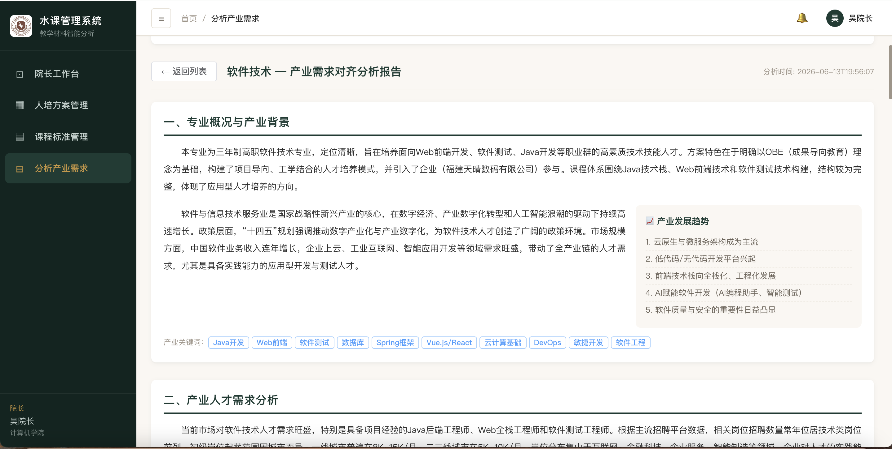
</p>

### 5. Prompt 模板管理系统

教务处可在线编辑 16 个专业 AI Prompt 模板，支持**自动版本管理**：

<p align="center">
  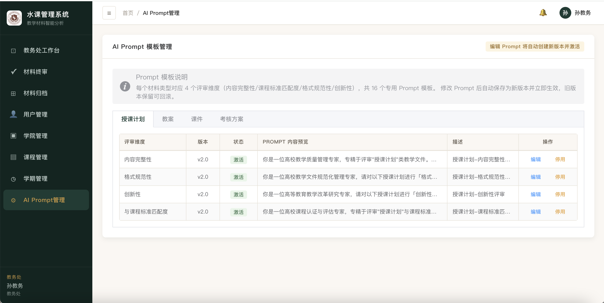
</p>

### 6. 更多功能亮点

| 功能 | 说明 |
|------|------|
| 📢 **通知中心** | 全流程 7 类场景自动推送（提交/AI完成/审核结果/驳回提醒），铃铛角标 30s 自动刷新，红点未读提醒 |
| 📥 **CSV 批量导入** | 支持 CSV/TXT 一键导入用户，密码默认规则 `fzrjxy+工号`，学院识别兼容名称或 ID，导入结果详细反馈 |
| 📁 **材料归档** | 教务处按类型/课程/教师多维筛选，Word/PDF 在线预览，批量下载 |
| 🔐 **数据隔离** | 主任仅见本院材料、教师仅见个人、院长仅见本学院人培方案，RBAC + college_id 双重过滤 |
| 🗑️ **安全删除** | 删除材料时分步清理：MinIO 文件 → AI 评审记录 → 数据库记录，彻底杜绝残留数据 |
| 📄 **文档解析** | PDFBox + POI 双引擎解析 Word(.doc/.docx) + PDF 全文，内容自动缓存供 AI 评审读取 |

#### 更多功能截图

| 登录页 | 材料提交 | 材料归档 | 批量导入 |
|--------|----------|----------|----------|
| 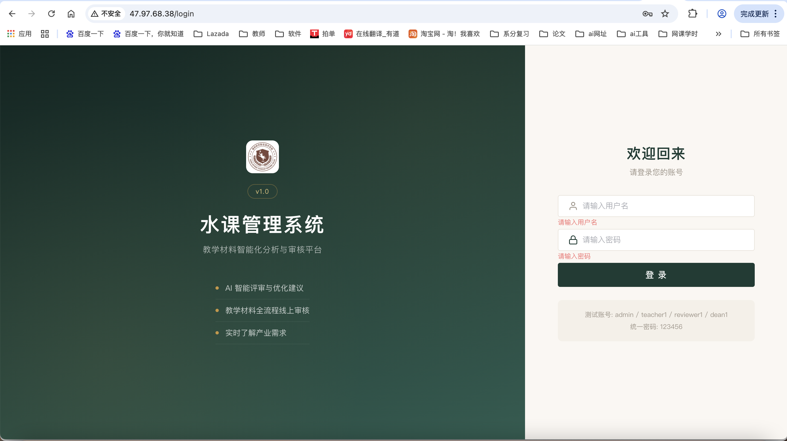 | 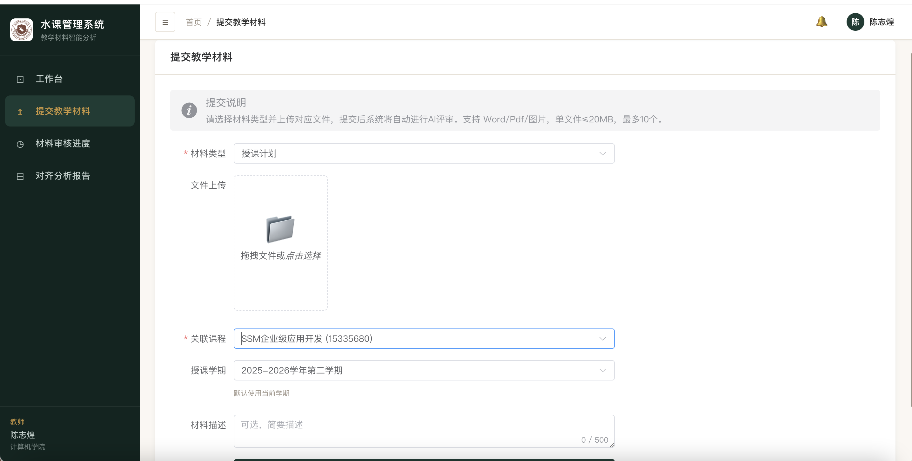 | 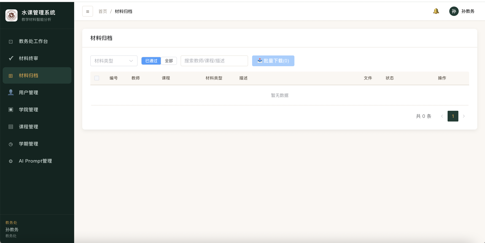 | 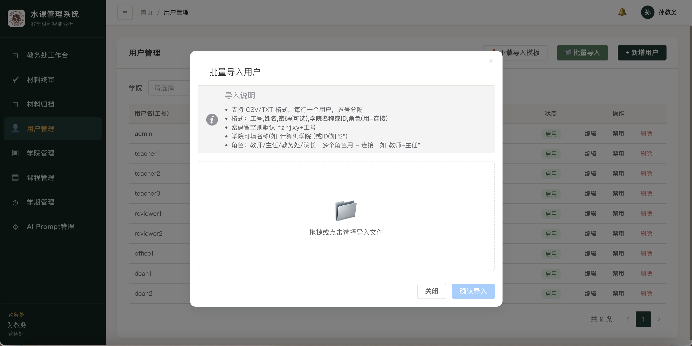 |

| 用户管理 | 课程管理 | 学期管理 | 学院管理 |
|----------|----------|----------|----------|
| 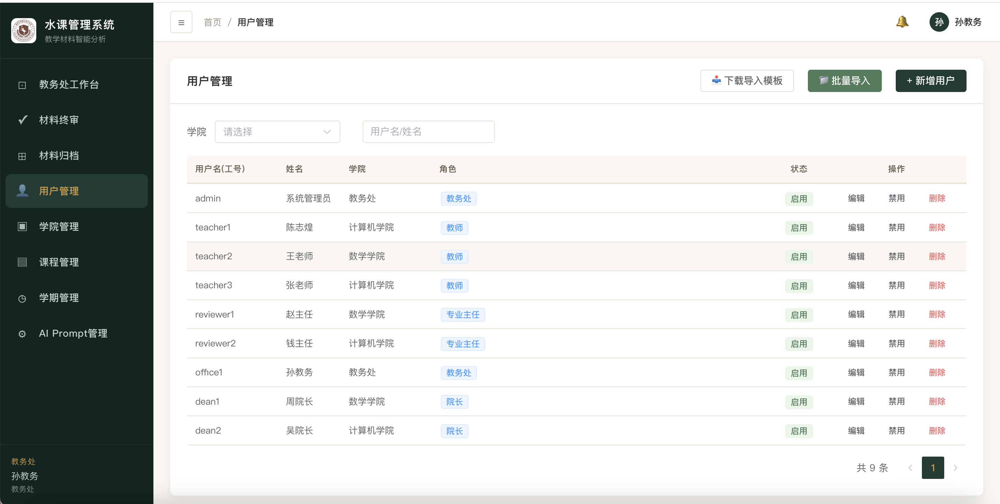 | 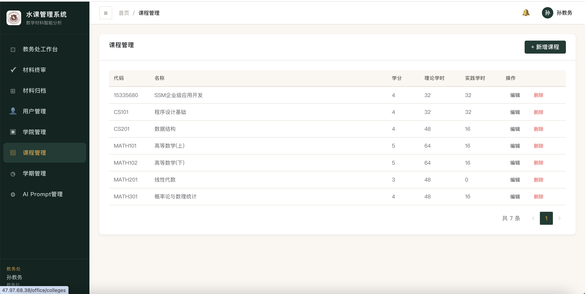 | 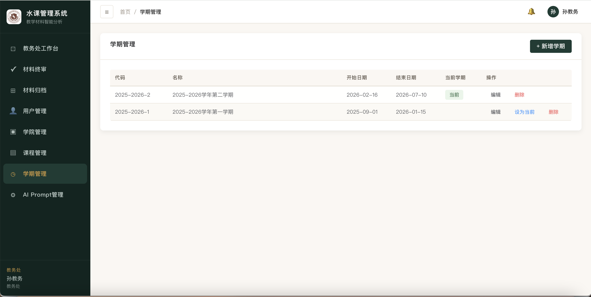 | 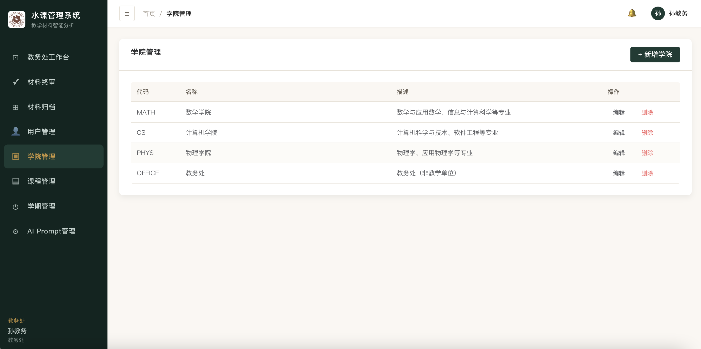 |

| 新增人培方案 | 新增课程标准 | 教师端对齐报告 | 教师端审核进度 |
|--------------|--------------|----------------|----------------|
| 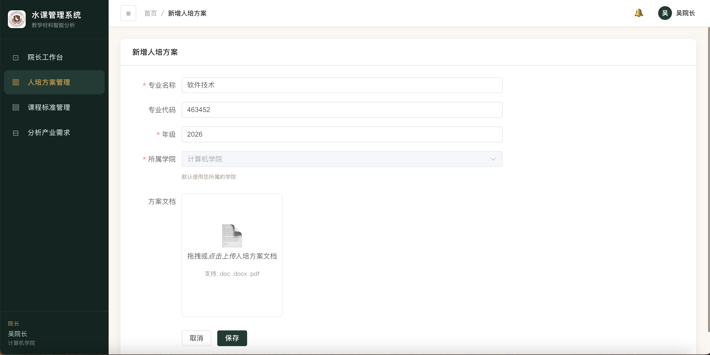 | 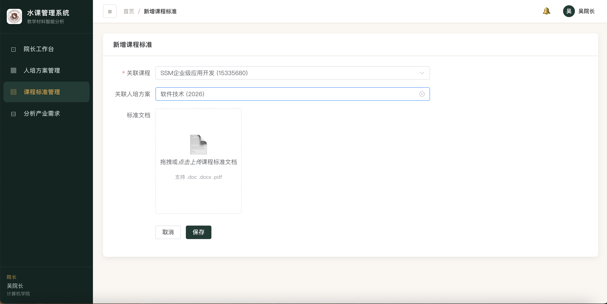 | 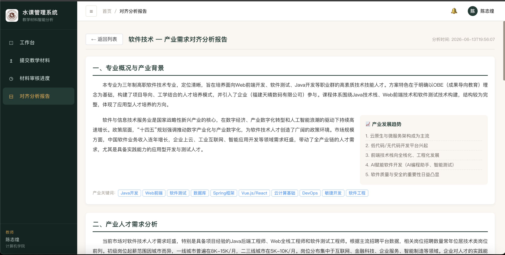 | 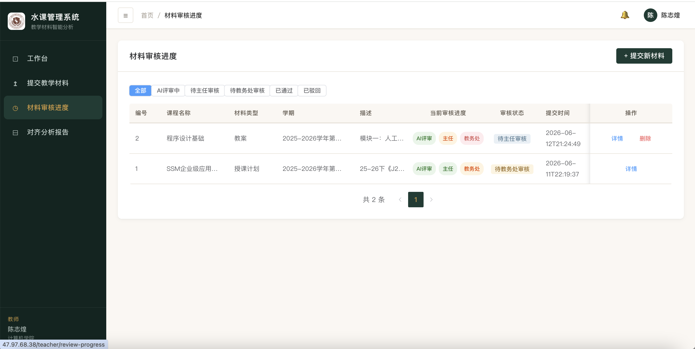 |

---

## 🛠️ 技术栈

| 层级 | 技术 | 版本 | 选型理由 |
|------|------|------|------|
| **后端框架** | Spring Boot + Spring Security + JWT | 2.7.x | 兼容 Java 8 生产环境 |
| **ORM** | MyBatis-Plus | 3.5.5 | 简化 CRUD，Lambda 条件构造 |
| **数据库** | MySQL | 8.0 (开发) / 5.6 (生产) | 生产环境为阿里云 ECS 原生 MySQL 5.6 |
| **缓存** | Redis | 7.x | 条件化配置，测试自动跳过 |
| **文件存储** | MinIO (S3 兼容) | latest | 按材料类型分目录，预签名 URL 预览下载 |
| **AI 引擎** | 火山引擎方舟 API (豆包/DeepSeek) | v3 | RestTemplate HTTP 调用，180s 读取超时 |
| **文档解析** | Apache PDFBox + POI | 2.0.30 / 5.2.5 | 双引擎覆盖 Word(.doc/.docx) + PDF |
| **前端框架** | Vue 3 + TypeScript | 3.4+ | Composition API + `<script setup>` |
| **UI 组件库** | Element Plus | 2.7+ | 中文友好，组件丰富 |
| **状态管理** | Pinia | 2.x | Vue 3 官方推荐 |
| **图表** | ECharts | 5.x | 多角色 Dashboard 12+ 张交互图表 |
| **构建工具** | Vite | 5.x | 快速 HMR，生产构建 7 秒 |
| **容器化** | Docker + Docker Compose | — | 5 服务一键部署 |
| **部署平台** | 阿里云 ECS + ACR | — | CentOS 7 x86_64 |

### 关键技术决策

1. **Java 8 + MySQL 5.6**：主动降级以兼容生产环境（ECS 原生 MySQL 5.6.26）
2. **`@Async` + 显式传参**：异步 AI 评审避免阻塞 HTTP 响应，userId 从 Controller 透传避免 SecurityContext 丢失
3. **CompletableFuture 四维并发**：4 个评审维度同时调用 LLM，`allOf()` 聚合结果后计算加权分
4. **Prompt 版本控制**：在线编辑自动创建新版本、旧版本标为不激活，支持回退
5. **MinIO 文件命名**：`{材料类型}/{yyyy/MM}/{原文件名}_{HHmmss}.{扩展名}`
6. **JWT 双 Token**：访问令牌 2h + 刷新令牌 7d，Axios 拦截器自动刷新

---

## 📁 项目结构

```
shuike-manager/
├── backend/                                  # Spring Boot 后端
│   ├── src/main/java/com/shuike/manager/
│   │   ├── common/                           # 公共模块
│   │   │   ├── config/                       # SecurityConfig, MyBatisPlusConfig, AsyncConfig...
│   │   │   ├── security/                     # JwtTokenProvider, JwtAuthenticationFilter, SecurityUtils
│   │   │   ├── exception/                    # GlobalExceptionHandler, BusinessException, ErrorCode
│   │   │   ├── response/                     # ApiResponse<T>, PageResult<T>
│   │   │   ├── aspect/                       # OperationLog AOP
│   │   │   └── constant/                     # PlanStatusEnum, RoleEnum
│   │   └── modules/
│   │       ├── auth/                         # 认证：登录 + JWT 刷新 + 修改密码
│   │       ├── user/                         # 用户管理：CRUD + CSV 批量导入 + 模板下载
│   │       ├── college/                      # 学院管理
│   │       ├── course/                       # 课程管理
│   │       ├── semester/                     # 学期管理 + 激活切换
│   │       ├── phasematerial/                # 🔴核心：材料 CRUD + 教师列表 + 审核列表 + 归档 + 附件
│   │       ├── aievaluation/                 # 🔴核心：AI 评审提交/执行/查询 + Prompt 模板 CRUD + 版本管理
│   │       ├── manualreview/                 # 🔴核心：两级审核（COLLEGE → OFFICE）
│   │       ├── alignment/                    # 产业需求对齐分析（异步 LLM 调用）
│   │       ├── talentplan/                   # 人培方案管理 + 矩阵映射
│   │       ├── coursestandard/               # 课程标准管理
│   │       ├── notification/                 # 通知中心（CRUD + 未读统计）
│   │       ├── dashboard/                    # 4 角色 Dashboard 统计
│   │       ├── file/                         # 文件上传到 MinIO + 文档解析 + 预览下载
│   │       ├── ai/                           # VolcanoEngineClient + PromptBuilder + ResultParser
│   │       ├── teachingplan/                 # 教学计划（旧版兼容）
│   │       └── review/                       # 审核（旧版兼容）
│   ├── src/test/                             # 42 个集成测试
│   ├── Dockerfile                            # 多阶段构建：Maven 编译 → Corretto 运行
│   └── pom.xml
├── frontend/                                 # Vue 3 前端
│   ├── src/
│   │   ├── views/teacher/                    # 教师端 8 页（Dashboard/提交材料/审核进度/产业报告...）
│   │   ├── views/college/                    # 主任端 3 页（Dashboard/材料审核列表）
│   │   ├── views/office/                     # 教务处端 10 页（Dashboard/用户管理/材料归档/AI评审管理...）
│   │   ├── views/dean/                       # 院长端 6 页（Dashboard/人培方案/课程标准/对齐分析报告）
│   │   ├── views/login/                      # 登录页（Hero+表单双栏布局）
│   │   ├── api/                              # Axios 封装 + 拦截器 + API 模块
│   │   ├── stores/                           # Pinia 状态管理（auth.ts / app.ts）
│   │   ├── router/                           # 4 角色路由树 + beforeEach 守卫
│   │   └── layouts/                          # MainLayout + 侧边栏 + 顶部导航
│   ├── nginx.conf                            # Nginx 反向代理配置（/api → backend:8080）
│   ├── Dockerfile                            # Node 构建 → Nginx 运行
│   └── package.json
├── docker-compose.yml                        # 5 服务编排（MySQL+Redis+MinIO+Backend+Frontend）
├── mysql.cnf                                 # MySQL 中文编码配置
├── docs/                                     # 技术文档
│   ├── prd需求分析/                           # PRD 产品需求文档
│   ├── 前端需求分析/                           # 前端详细设计
│   ├── 后端需求分析/                           # 后端详细设计
│   ├── 数据库/                                # database.sql + database-v2.0.sql + prompt_data.sql
│   ├── 测试报告/                              # 软件测试报告 + 闭环测试报告 + 部署问题修复指导
│   ├── 需求版本管理.md                        # v1.1 → v2.0 演进记录
│   ├── 项目配置手册.md                        # ECS 部署 + Docker + 常见问题
│   ├── API.md                                # 50+ REST API 完整文档
│   └── pitch-deck/                           # 路演网页版 PPT（自包含单文件）
├── screenshots/                              # 21 张系统截图
├── README.md
└── CLAUDE.md                                 # Claude Code 项目指引
```

---

## 🚀 快速开始

### 前置条件

| 工具 | 版本要求 | 说明 |
|------|------|------|
| JDK | 8+ | 本地开发编译后端 |
| Maven | 3.5+ | 依赖管理和构建 |
| Node.js | 18+ | 前端开发 |
| Docker Desktop | — | 推荐，一键启动全部服务 |

### 本地开发

```bash
# 1. 导入数据库
mysql -u root -p < docs/数据库/database.sql
mysql -u root -p --default-character-set=utf8 < docs/数据库/prompt_data.sql

# 2. 启动后端 (JDK 8)
cd backend
export JAVA_HOME=/Library/Java/JavaVirtualMachines/jdk1.8.0_202.jdk/Contents/Home
mvn spring-boot:run
# → http://localhost:8080

# 3. 启动前端
cd frontend
npm install && npm run dev
# → http://localhost:3000 (自动代理 /api → :8080)
```

### Docker 一键部署

```bash
# 启动全部 5 个服务 (MySQL + Redis + MinIO + Backend + Frontend)
docker compose up -d --build

# 创建 MinIO 存储桶（仅首次）
docker exec shuike-minio mc mb local/shuike-manager

# 导入 Prompt 数据（仅首次）
docker exec -i shuike-mysql mysql -u root -pshuike@2026 \
  --default-character-set=utf8 < docs/数据库/prompt_data.sql

# → http://localhost          (前端)
# → http://localhost:8080     (后端 API)
# → http://localhost:9001     (MinIO 控制台 minioadmin/minioadmin123)
```

### 默认账号

| 用户名 | 密码 | 角色 | 所属学院 |
|--------|------|------|---------|
| `office1` | `123456` | 教务处 | 教务处 |
| `teacher1` | `123456` | 教师 | 计算机学院 |
| `teacher2` | `123456` | 教师 | 数学学院 |
| `reviewer2` | `123456` | 专业主任 | 计算机学院 |
| `reviewer3` | `123456` | 专业主任 | 数学学院 |
| `dean1` | `123456` | 院长 | 计算机学院 |
| `dean2` | `123456` | 院长 | 数学学院 |

---

## 🐛 开发问题记录

> 完整排查指南见 [docs/测试报告/部署问题修复指导.md](docs/测试报告/部署问题修复指导.md)

| # | 问题 | 症状 | 根因 | 解决方案 | 日期 |
|---|------|------|------|------|------|
| 1 | 对齐分析无结果 | LLM 返回成功但报告列表始终为空 | ECS 数据库 `alignment_reports` 表缺少 v2.0 新增的 `report_json` 列 | `ALTER TABLE` 增量补列，建立 schema 版本检查机制 | 06-13 |
| 2 | `@Async` 丢失用户 ID | `initiatorId` 始终为 null | 异步线程池独立线程无法继承 HTTP 请求的 SecurityContext | Controller 层提前取出 userId 显式传参，禁止异步方法调用 SecurityUtils | 06-13 |
| 3 | Mac ARM64 Docker Build 极慢 | `docker build --platform linux/amd64` 耗时 3h+ | QEMU 用户态模拟 Java 编译（每条字节码 → 50+ 条 ARM 指令） | 本地 `mvn package`(30s) → scp JAR 到 ECS → `docker cp` 替换容器 → restart，总耗时 1-2 分钟 | 06-13 |
| 4 | MySQL 中文乱码 | 中文数据显示为 `???` | ECS MySQL 5.6 默认 latin1 编码 | 添加 `skip-character-set-client-handshake` + 挂载 `mysql.cnf` 设置 `utf8mb4` | 06-11 |
| 5 | MinIO 文件上传失败 | 首次部署后上传文件 404 | MinIO 容器启动后 `shuike-manager` bucket 未创建 | `docker exec shuike-minio mc mb local/shuike-manager` | 06-11 |
| 6 | JWT Token 无效 | 登录后 API 返回 401 | JWT Secret 不足 256 bits | 设置 `JWT_SECRET` 环境变量 ≥ 32 字符 | 06-11 |
| 7 | 本地 Docker 数据库无数据 | Dashboard 图表全空 | `docker-compose.yml` 绑定的 `./docs/database.sql` 路径在文档重组后失效 | 修正为 `./docs/数据库/database.sql`，补充 `semester_id` 列 | 06-14 |
| 8 | 学院搜索下拉框太窄 | 用户管理页面学院名称显示不全 | `el-select` 未设置宽度 | 添加 `style="width:180px"` | 06-13 |

### 经验教训

1. **Schema 版本管理**：每次数据表变更必须用 `ALTER TABLE` 执行到 ECS 生产库，不能仅依赖 `docs/` 中的建表脚本（只在容器首次 `docker compose up` 时执行）
2. **异步安全上下文**：`@Async` 方法绝不能调用 `SecurityUtils`，必须在 Controller 层提前取出所需用户信息作为参数传入
3. **跨架构构建**：Mac ARM64 开发 Java 项目时，后端不用 `docker build --platform linux/amd64`，改用本地编译 JAR → scp 到 ECS 替换
4. **路径一致性**：文档重组时需同步更新 `docker-compose.yml` 中的卷挂载路径

---

## 📝 需求迭代记录

> 详细记录见 [docs/需求版本管理.md](docs/需求版本管理.md)

### v2.1 (2026-06-14) — 当前版本

- ✅ Dashboard 图表优化：各学院各材料类型 AI 平均分分组柱状图
- ✅ superpowers-zh 技能框架安装（25 个 skills）
- ✅ 项目级开发规则配置
- ✅ 路演网页版 PPT（16 页自包含单文件）
- ✅ API 文档完整输出（50+ 接口）

### v2.0 (2026-06-12)

- ✅ 两级审核流程（学院主任→教务处）
- ✅ 真实火山引擎 LLM 调用，四维并发评审
- ✅ 16 套 Prompt 模板（在线编辑+自动版本管理）
- ✅ 产业需求对齐分析（LLM 生成 8 章论文式报告）
- ✅ 通知中心全流程推送
- ✅ 材料归档 + CSV 批量导入用户
- ✅ 学院数据隔离
- ✅ 全新 UI 设计系统（温暖学术风格）
- ✅ Docker Compose 一键部署

### v1.1 (2026-06-08) — 已归档

- 教学计划 CRUD + 文件上传
- 单级审核流程
- 模拟 AI 评审数据
- 6 角色体系

#### v1.1 → v2.0 重大变更

| 维度 | v1.1 | v2.0 |
|------|------|------|
| 角色数 | 6 个 | **4 个**（精简合并） |
| 审核层级 | 单级（仅教务处） | **两级**（主任→教务处） |
| AI 评审 | 模拟数据 | **真实 LLM 并发调用** |
| Java 版本 | 17 → **降级到 8** | 适配生产环境 |
| 测试用例 | 23 个 | **42 个** |
| 新增模块 | — | 对齐分析、通知中心、材料归档、Prompt 管理、批量导入 |

---

## 🚀 项目推广计划

### 阶段一：校内试点（当前）

| 任务 | 目标 | 状态 |
|------|------|:--:|
| 收集试点反馈 | 征集使用意见，优化用户体验 | 🔜 |
| 性能压力测试 | 模拟 100+ 教师并发提交材料 | 🔜 |
| 完善操作手册 | 编写各角色使用说明文档 | 🔜 |

### 阶段二：校内推广

| 任务 | 目标 |
|------|------|
| 校内路演 | 向教务处/各学院院长展示系统价值 |
| 全量数据导入 | 导入所有教师、课程、历史教学材料 |
| 对接教务系统 | 与学校现有教务管理系统数据互通 |
| 培训推广 | 组织各学院教师使用培训 |

### 阶段三：对外推广

| 任务 | 目标 |
|------|------|
| 技术博客 | 撰写技术文章发布到掘金/CSDN/知乎 |
| 开源发布 | GitHub 正式开源，撰写中英文 README |
| 参加会议 | 教育信息化相关的学术会议/展会展示 |
| 产品化 | SaaS 化部署方案，支持多学校租户隔离 |
| 合作推广 | 与教育信息化企业合作，推广至更多高校 |

### 项目亮点（路演话术）

1. **真实的业务痛点**：高校每学期数千份教学材料审核是硬需求，AI 替代人工初审有明确的 ROI
2. **创新的技术方案**：四维并发评审 + Prompt 引擎 + 对齐分析，是完整的"AI 驱动教学管理方法论"
3. **完整的工程交付**：PRD→设计→开发→测试→Docker→ECS 全链路闭环，42 个测试 100% 通过
4. **可复制的模式**：架构设计支持多学校租户隔离，具备产品化潜力

---

## 📚 文档索引

| 文档 | 路径 | 说明 |
|------|------|------|
| PRD 需求分析 | [docs/prd需求分析/](docs/prd需求分析/) | 产品需求文档 |
| 前端需求分析 | [docs/前端需求分析/](docs/前端需求分析/) | 前端详细设计 |
| 后端需求分析 | [docs/后端需求分析/](docs/后端需求分析/) | 后端详细设计 |
| 数据库设计 | [docs/数据库/](docs/数据库/) | Schema + Prompt 种子数据 |
| API 文档 | [docs/API.md](docs/API.md) | 50+ REST API 完整文档 |
| 项目配置手册 | [docs/项目配置手册.md](docs/项目配置手册.md) | ECS 部署 + 环境配置 |
| 需求版本管理 | [docs/需求版本管理.md](docs/需求版本管理.md) | v1.1 → v2.0 演进记录 |
| 软件测试报告 | [docs/测试报告/软件测试报告.md](docs/测试报告/软件测试报告.md) | 23 用例 API 测试 |
| 闭环测试报告 | [docs/测试报告/闭环测试报告.md](docs/测试报告/闭环测试报告.md) | 19 用例 E2E 测试 |
| 部署修复指南 | [docs/测试报告/部署问题修复指导.md](docs/测试报告/部署问题修复指导.md) | 8 个问题排查修复 |
| 路演 PPT | [docs/pitch-deck/index.html](docs/pitch-deck/index.html) | 16 页网页版 PPT（自包含） |

---

## 🧪 自动化测试

```bash
# 运行全部 42 个测试用例
cd backend
export JAVA_HOME=/Library/Java/JavaVirtualMachines/jdk1.8.0_202.jdk/Contents/Home
mvn test

# 功能测试 (23 个)
mvn test -Dtest=ShuiKeIntegrationTest

# 闭环 E2E 测试 (19 个)
mvn test -Dtest=ClosedLoopIntegrationTest
```

**测试结果**: `Tests run: 42, Failures: 0, Errors: 0, Skipped: 0` ✅

**测试覆盖**: 登录认证、角色权限、材料提交、AI 评审触发、审核流转、通知推送、Dashboard 统计、对齐分析、CRUD 操作、边界条件

**Mock 策略**: `@MockBean(MinioClient.class)` 模拟文件存储，`RedisConfig` 通过 `@ConditionalOnBean` 在测试环境自动跳过

---

## 🌐 线上环境

| 配置项 | 值 |
|--------|-----|
| 生产地址 | http://47.97.68.38 |
| MinIO 控制台 | http://47.97.68.38:9001 |
| 镜像仓库 | `crpi-x4kb991wgxw0oamg.cn-hangzhou.personal.cr.aliyuncs.com/shuike2026/` |
| SSH | `ssh root@47.97.68.38` |
| 部署路径 | `/opt/shuike/` |

---

## 👨‍💻 开发者

- **GitHub**: [chenzh-lgtm](https://github.com/chenzh-lgtm)
- **仓库**: https://github.com/chenzh-lgtm/shuike-manager
- **技术栈**: Spring Boot 2.7 + Vue 3 + MySQL + Redis + MinIO + Docker
- **AI 引擎**: 火山引擎方舟 API（豆包/DeepSeek）

---

> **版本**: v2.1 | **更新时间**: 2026-06-14 | **接口总数**: 50+ | **测试覆盖**: 42/42 ✅
